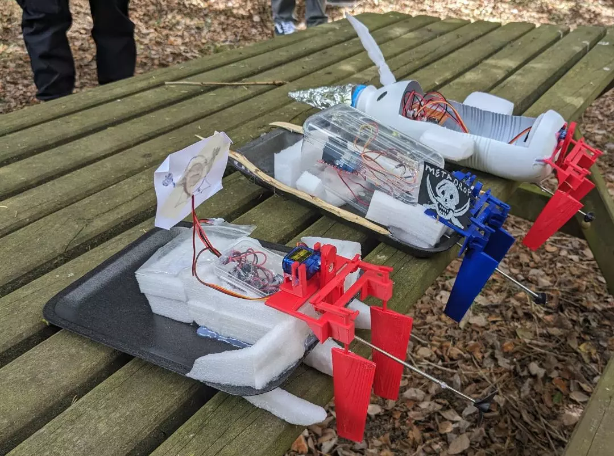

# ESP32 BLE Motor and Servo Control



Project supported by [Metadrop](https://metadrop.net/) and [Omnia Makers](https://omnia-makers.github.io/)

## Overview
This project is designed to control a motor and a servo using an ESP32 with Bluetooth Low Energy (BLE) communication. The ESP32 interacts with an L298N H-Bridge motor driver and a servo motor based on received BLE commands.

[Article Building RC Boat using ESP32](https://metadrop.net/en/articles/building-rc-boat-using-esp32)

## Hardware Components
- ESP32
- L298N H-Bridge Motor Driver
- Servo Motor
- External Power Supply (if needed for motors)
- Connecting Wires

## Software Structure
The application is structured as follows:

```
├── client
│   ├── icons
│   └── index.html
├── connect
│   ├── connect.ino
│   ├── DataParser.cpp
│   ├── DataParser.h
│   ├── power.cpp
│   ├── power.h
│   ├── servo.cpp
│   └── servo.h
└── README.md
```

### File Descriptions
- **connect.ino**: The main Arduino sketch that initializes BLE communication, sets up services, and handles incoming BLE data.
- **DataParser.cpp / DataParser.h**: Functions to parse and process incoming BLE commands.
- **power.cpp / power.h**: Functions to control the motor through the L298N driver.
- **servo.cpp / servo.h**: Functions to control the servo motor using PWM signals.

## Setup and Connections

### ESP32 to L298N (Motor Driver)
| ESP32 Pin | L298N Pin |   Motor   |
|-----------|-----------|-----------|
| GPIO 27   | IN1       | OUT1      |
| GPIO 26   | IN2       | OUT2      |
| GND       | GND       |           |
| 5V        | VCC       |           |

### ESP32 Mini C3 to L298N (Motor Driver)
| ESP32 Pin | L298N Pin |   Motor   |
|-----------|-----------|-----------|
| GPIO 0    | IN1       | OUT1      |
| GPIO 10   | IN2       | OUT2      |
| GND       | GND       |           |
| 5V        | VCC       |           |

Change motorPin1 and motorPin2 on power.cpp if use ESP32 or ESP32Mini

### ESP32 and ESP32Mini to Servo Motor
| ESP32 Pin | Servo Pin  |
|-----------|-----------|
| GPIO 2    | Signal    |
| GND       | GND       |
| 5V        | VCC       |

## BLE Communication
- The ESP32 sets up a BLE server with the following parameters:
  - **Service UUID**: `4fafc201-1fb5-459e-8fcc-c5c9c331914b`
  - **Characteristic UUID**: `beb5483e-36e1-4688-b7f5-ea07361b26a8`
  - **DEVICE_NAME**: `METALANCHA`
- Change the device name on bluetooth.h if it will be running more deviced at the same time.
- Commands can be sent over BLE to control the motor and servo.
- Example Commands:
  - `on` → Turns the motor on
  - `off` → Stops the motor
  - `testservo` → Moves the servo to various angles
  - `testpower` → Runs a motor power test
  - `x <angle>` → Moves the servo to the specified angle
  - `y <power>` → Sets the motor power level
  - `x <angle> y <power>` → Moves servo and adjusts motor power simultaneously

## Client

The client is a web-based interface that communicates with the ESP32 server via Bluetooth. It allows users to send control commands using an on-screen joystick and sliders.

### How It Works

1. **Connection Process**
   - The client scans for available Bluetooth devices and connects to the ESP32.
   - Once connected, the client initializes the Bluetooth service and characteristic for communication.

2. **Sending Commands**
   - The joystick interface captures movement data (X and Y values).
   - These values are converted into commands and sent to the ESP32 via Bluetooth.
   - Additional settings, such as reversing controls and setting maximum speed/turn limits, are adjustable via sliders.

3. **Communication with the Server**
   - The client sends commands in the format:
     ```
     x<TimonValue> y<MotorValue>
     ```
     Example:
     ```
     x100 y200
     ```
   - These commands are written to the Bluetooth characteristic and received by the ESP32.

4. **Automatic Command Transmission**
   - The client continuously sends commands at a set interval to ensure real-time control.
   - The motor can be toggled ON/OFF using a switch.

### Key Features

- **Dynamic Joystick**: Uses the NippleJS library to capture directional input.
- **Bluetooth Connectivity**: Utilizes the Web Bluetooth API to establish a connection.
- **Live Feedback**: Displays logs and connection status for troubleshooting.

This client interface enables a seamless and interactive way to control the ESP32-powered system wirelessly.


## Running the Application
1. Upload the `connect.ino` sketch and associated files to the ESP32.
2. Power up the ESP32 and motor driver.
3. Use a BLE-capable device to connect and send commands.
4. Observe the motor and servo responding to commands.

## Notes
- Ensure that the ESP32 is powered adequately to handle both BLE and motor control.
- The motor may require an external power source depending on its power consumption.
- The servo, the H-bridge, and the ESP32 can be connected directly to the power supply, but the GND wire must also be connected to the GND of the ESP32.
- The power supply must be between 5V and a maximum of 12V.
